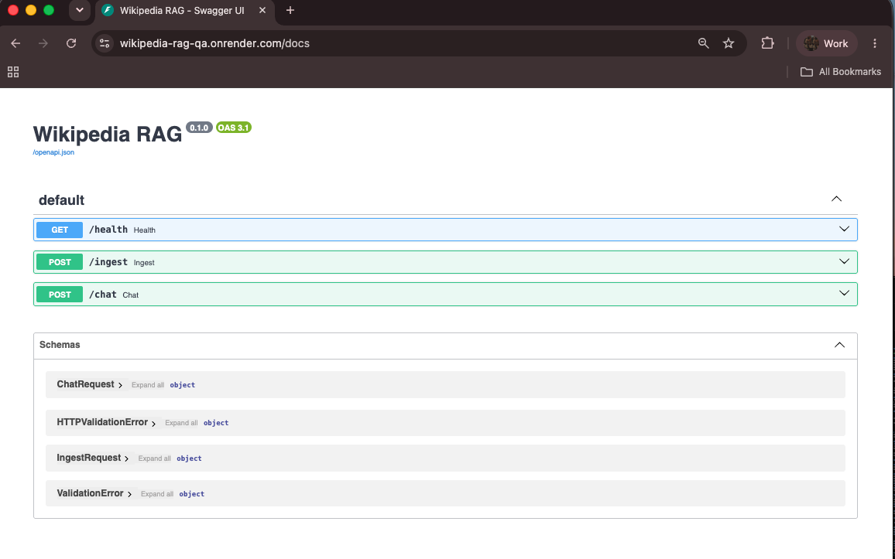
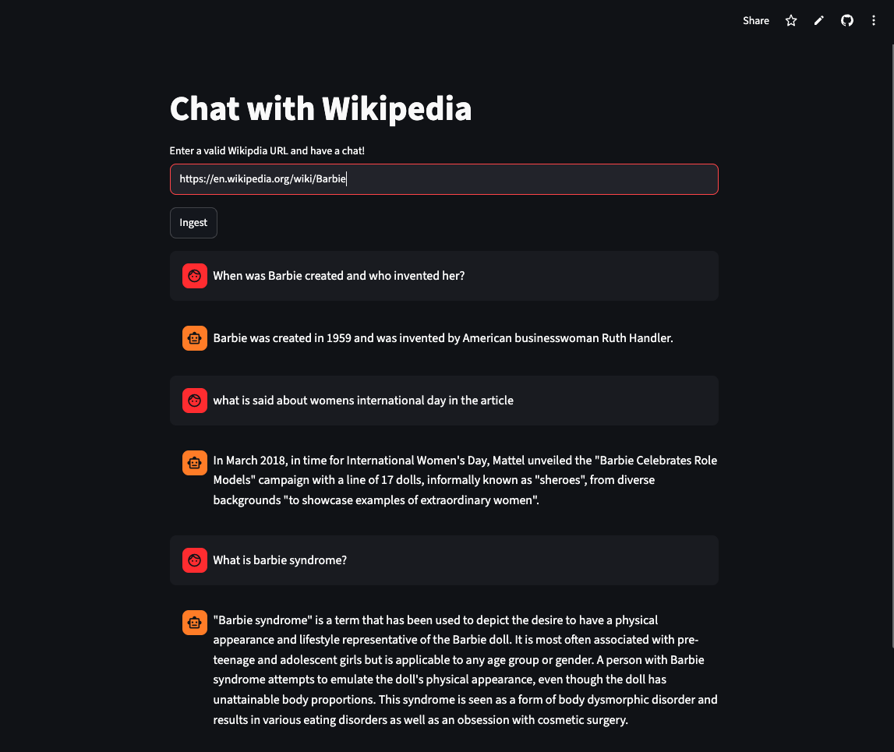
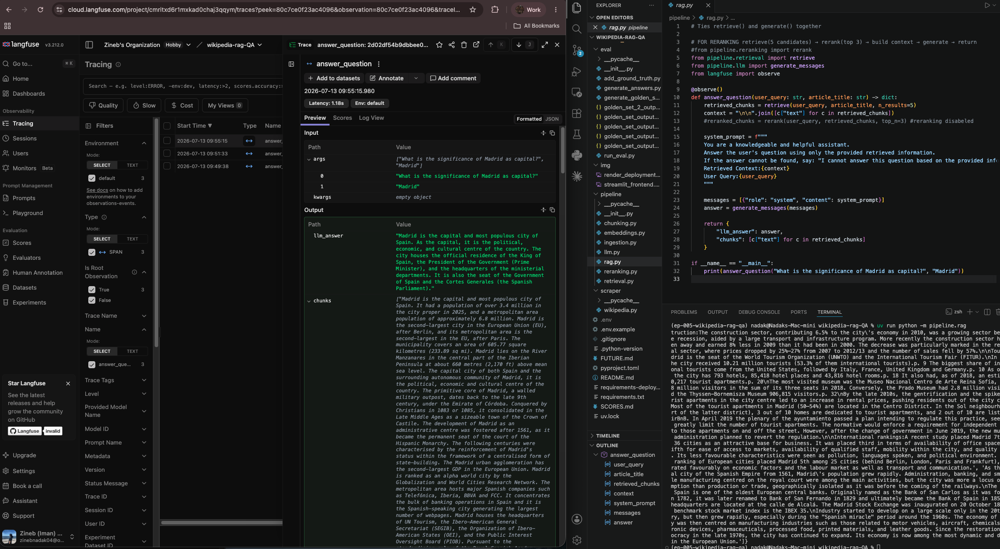
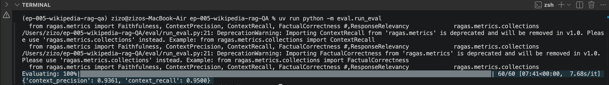
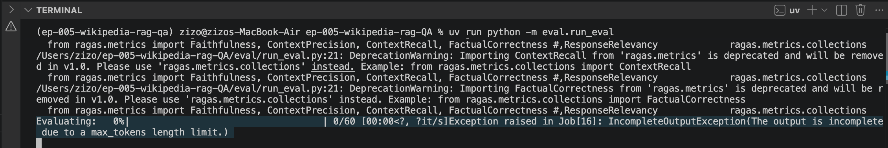

# Episode 005 - Wikipedia RAG Q&A

> Takeaway: Eval-first RAG means measure before you optimize. For production use cases where answer accuracy matters most, hybrid search would beat reranking for factual correctness

## The Problem / The Question
Second RAG build but this time with Wikipedia as the data source, same overall pattern as my first demo project (ha.ax) but rebuilt with evaluation, better chunking, hybrid search, and reranking. 

I chose Wikipedia text because it is noisier than a university website. Inconsistent heading structure, much longer articles, irrelevant sections interrupting flow, etc. I wanted to measure how a RAG pipeline actually behaves on large, unstructured, real-world corpora.

## What I built
An AI-powered tool that lets you explore and study Wikipedia articles through a retrieval-based chat. You paste in a valid wikipedia URL, and the tool opens a chat for it. 

#### Backend - Requirements in requirements-deploy.txt

[Render API URL](https://wikipedia-rag-qa.onrender.com/docs)



#### Frontend - Requirements in requirements.txt

[Streamlit Cloud URL](https://wikipedia-rag-app.streamlit.app/)



## Architecture 
The pipeline has two main flows:

### Ingestion (one-time per article), FastAPI /ingest
URL → extract title → scrape Wikipedia API → heading-aware chunking → 
contextual embedding (Groq generates 2-3 sentence summary per chunk, 
prepended before embedding) → stored in ChromaDB

### Retrieval & Generation (per user question), FastAPI /chat + Logged to Langfuse
Question → hybrid search (BM25 sparse + OpenAI dense embeddings, 
merged with Reciprocal Rank Fusion k=60) → top 5 chunks → 
Groq LLM generation (context-only system prompt) → answer

## Features
- Load any Wikipedia article as a knowledge source.
- Chat with the article using natural language questions.
- Retrieve relevant information using hybrid search (dense embeddings + BM25).
- Generate answers grounded in the retrieved Wikipedia context.

## Observability
Every `/chat` request is traced in Langfuse using the `@observe()` decorator on `answer_question()`. Each trace logs the question, retrieved chunks count, generated answer, and latency.




## What I Learned
- Heading-aware chunking using a regex-based parser.
- Retrieval evaluation using RAGAS to compare dense retrieval, contextual embeddings, hybrid search, and reranking strategies.
- Hybrid search by combining BM25 sparse retrieval with dense vector search using Reciprocal Rank Fusion (RRF).
- Contextual embeddings by prepending an LLM-generated summary to each chunk before embedding.
- Cross-encoder reranking using BAAI/bge-reranker-base to improve the ordering of retrieved chunks.
- Retrieval evaluation with RAGAS, comparing dense retrieval, hybrid search, and reranking against a human-verified ground truth dataset.
- LLM-as-a-Judge evaluation with GPT-4o through RAGAS using metrics such as Context Precision, Context Recall, Faithfulness, and Factual Correctness.
- Langfuse observability with @observe, logging each question, retrieved context, and generated answer.
- AI libraries evolve rapidly, making dependency and compatibility issues common; keeping packages aligned and regularly testing integrations is essential.

## Eval Results (RAGAS)
See [`SCORES.md`](SCORES.md) for full documentation and notes.





## How to Run

```bash
# Create and activate a virtual environment
uv init
source .venv/bin/activate

# Install dependencies
uv sync

# Start the FastAPI backend, and visit http://127.0.0.1:8000/docs
uv run uvicorn app.main:app --reload

# In another terminal, start the Streamlit frontend
uv run streamlit run app/streamlit_app.py
```

### Optional: Ingest an article manually

```bash
uv run -m pipeline.ingestion
```

## Tech Used
- Lightweight but effective text embeddings using `paraphrase-MiniLM-L6-v2` for dense retrieval.
- ChromaDB for persistent vector storage and similarity search.
- BM25 (`rank_bm25`) for keyword-based sparse retrieval.
- Reciprocal Rank Fusion (RRF) to combine dense and sparse retrieval results.
- BGE Cross-Encoder (`BAAI/bge-reranker-base`) for reranking retrieved chunks by relevance.
- RAGAS for evaluating retrieval and generation quality against a human-verified ground truth dataset.
- GPT-4o as an LLM-as-a-Judge through RAGAS metrics.
- Groq LLM for answer generation and contextual chunk summaries.
- FastAPI for the backend API.
- Streamlit for the user interface.
- Langfuse for tracing and observing retrieval and generation flows.

## Known Issues / limitaions / Setup Notes

### RAGAS + OpenAI v2 compatibility fix 
RAGAS 0.4.x has a broken import from langchain_community.chat_models.vertexai. If RAGAS import fails with 
```
ModuleNotFoundError: No module named 'langchain_community.chat_models.vertexai' 
```

after installing, manually comment out two lines in .venv/lib/python3.12/site-packages/ragas/llms/base.py:
Line 12: 
```
from langchain_community.chat_models.vertexai import ChatVertexAI
```
Line 43: 
```
ChatVertexAI,
```

### RAGAS LLM wrapper
The evaluation pipeline uses `llm_factory` instead of the deprecated `LangchainLLMWrapper` approach, following the latest RAGAS recommendations.

### Groq free-tier rate limits
Contextual embedding generation uses Groq to create summaries before embedding. With large Wikipedia articles, ingestion can take 2–3 minutes due to free-tier rate limits. A production setup would use paid API limits, async batching, or background processing.

### Stateless retrieval
The current retrieval pipeline is stateless. Each question is processed independently, without persistent conversation memory beyond the active session.

### Reranking disabled due to additional compute and latency requirements.


## References
- [Inspo](https://medium.com/@perfectsolution808/wikipedia-based-q-a-chatbot-a-beginners-approach-using-free-tools-5067d501a6ab)
- [Wikipedia](https://www.wikipedia.org/)
- [groq docs](https://console.groq.com/docs/responses-api)
- [build a request URL](https://requests.readthedocs.io/en/latest/user/quickstart/#passing-parameters-in-urls)
- [handling url sections](https://docs.python.org/3/library/urllib.parse.html)
- [regex (regular expression) in Python](https://www.w3schools.com/python/python_regex.asp), [findall vs. finditer](https://www.tutorialspoint.com/article/what-is-the-difference-between-re-findall-and-re-finditer-methods-available-in-python)
- [RAGAS TestsetGenerator](https://docs.ragas.io/en/stable/getstarted/rag_testset_generation/#a-deeper-look)
- [Langchain Document Object](https://reference.langchain.com/python/langchain-core/documents/base/Document)
- LangChain's [ChatOpenAI](https://docs.langchain.com/oss/python/integrations/chat/openai) & [OpenAIEmbeddings](https://reference.langchain.com/python/langchain-openai/embeddings/base/OpenAIEmbeddings) (RAGAS speaks LangChain internally)
- [RAGAS 0.2.x mix of question types (default_query_distribution). Consisting of all three made to a default SingleHopSpecific/MultiHopAbstract/MultiHopSpecific - QuerySynthesizer](https://docs.ragas.io/en/stable/references/generate/)
- [llamaindex: from_documents, generate_dataset_from_nodes](https://developers.llamaindex.ai/python/framework-api-reference/evaluation/dataset_generation/)
- [Vector Embeddings Openai](https://developers.openai.com/api/docs/guides/embeddings)
- [Chromadb create client & collection](https://docs.trychroma.com/docs/overview/getting-started)
- [RAGAS Evaluation Dataset](https://docs.ragas.io/en/stable/concepts/components/eval_dataset/)
- [RAGAS Customise models](https://docs.ragas.io/en/stable/howtos/customizations/customize_models/)
- [RAGAS evaluate ()](https://docs.ragas.io/en/v0.2.8/references/evaluate/#ragas.evaluation.evaluate)
- [RAGAS avaliable metrics](https://docs.ragas.io/en/stable/concepts/metrics/available_metrics/)
- [Hybrid search: BM25Okapi algorithm](https://pypi.org/project/rank-bm25/)
- [Reranking: Cross-Encoders](https://sbert.net/examples/cross_encoder/applications/README.html)
- [Reranking: Cross-encoder model from HF (compare to embedding model, bi-coder. Thi is a cross-encoder,reranker.)](https://huggingface.co/BAAI/bge-reranker-base)
- [FastAPI docs](https://fastapi-tutorial.readthedocs.io/en/latest/)
- [streamlit docs](https://docs.streamlit.io/get-started/fundamentals/main-concepts)
- [Langfuse, create a trace manually](https://github.com/orgs/langfuse/discussions/7558)
